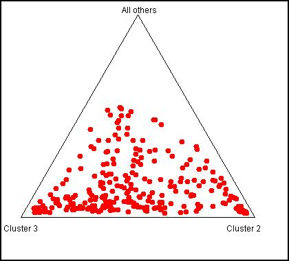
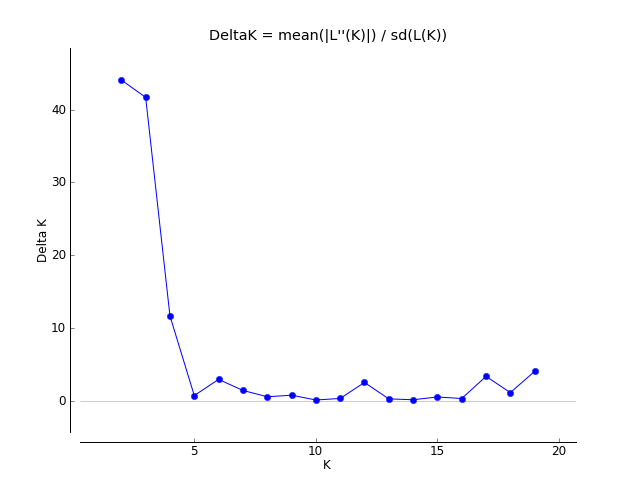
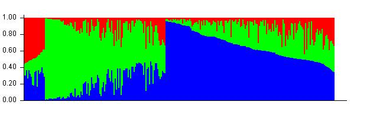
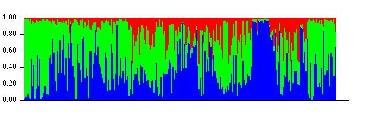
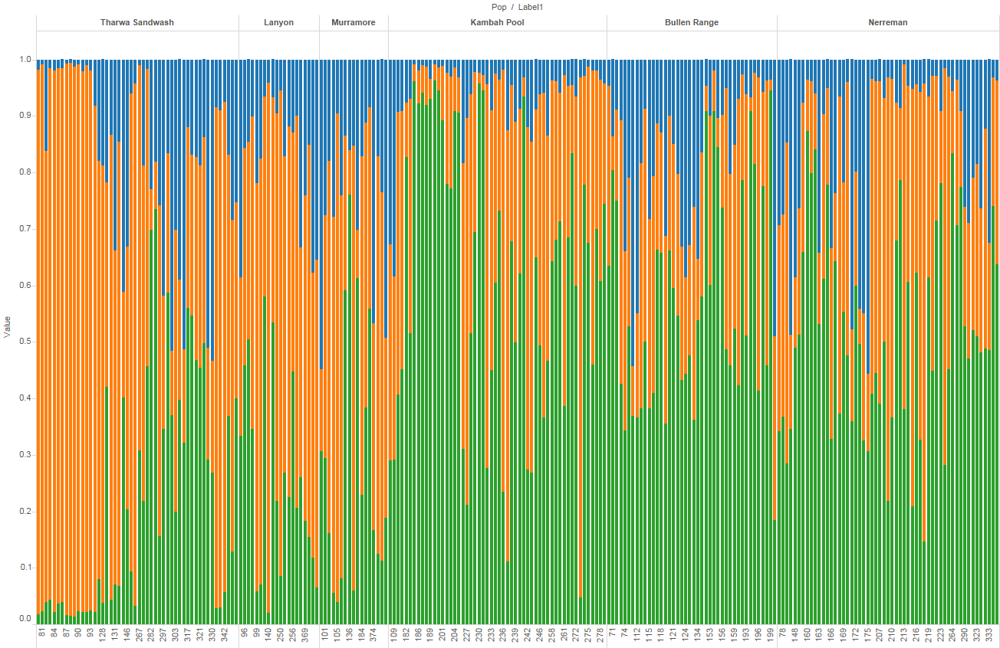

```{r, "Project_Template_and_Knitr", echo=FALSE, warning=FALSE}
#The following 2 and 4 lines are needed if knitr is to work with ProjectTemplate.
require(knitr)
if (basename(getwd()) == "src") setwd("..") #needed to get knitr to work with project template
library('ProjectTemplate') #All projectTemplates need this up front
load.project() #All projectTemplates need this up front
```

```{r "Set_Global_Options", echo=FALSE, warning=FALSE}
options(width=200)
opts_chunk$set(echo=TRUE, warning=FALSE, message=FALSE)
knitr::opts_chunk$set(fig.width=15, fig.height=15,fig.path="/graphs/") #Make Figures larger and save them
```

```{r}
a<-suppressPackageStartupMessages({
library(plyr)
library(dplyr)
library(ggplot2)
library(dart)
library(tsne)
library(adegenet) 
library(pegas)
library(hierfstat)
library(ade4)
library(mmod)
library(poppr)
})

ptm <- proc.time()
```

```{r echo=FALSE,results='hide'}
#read file in
gl<-gl.read.dart(datafile="otherData/larvalPeeliSnps.csv", topskip=5, nmetavar=17, nas="-", ind.metafile="otherData/larvMeta.csv")

#gl to gind
x.mat <- as.matrix(gl) # x is a genlight object
x.mat[x.mat == 0] <- "1/1" # homozygote reference
x.mat[x.mat == 1] <- "1/2" # heterozygote
x.mat[x.mat == 2] <- "2/2" # homozygote alternate
gi <- df2genind(x.mat, pop=gl@pop, sep = "/", ploidy = 2)

```

```{r echo=FALSE}
read_chunk('src/pcaTSNE.R')
```

```{r echo=FALSE}
read_chunk('plotsAveragePIC.R')
```

###Basic PopGen
```{r, echo=TRUE}
pairDistPlot(gi, gi$pop, within=FALSE, sep="-", data=FALSE,violin=TRUE, boxplot=TRUE, jitter=TRUE)

fstat(gi)

#Is the structure between populations significant?
popStrSig<- gstat.randtest(gi, nsim = 99)
popStrSig
plot(popStrSig)

giHs <- genind2hierfstat(gi)
#head(giHs)
varglob<-varcomp.glob(giHs$pop, giHs[, -1])
varglob$overall
varglob$F

#Pairwise Fst (populations)
matFst <- pairwise.fst(gi[1:50, treatOther = FALSE])
matFst
#Thus there is no significant difference between populations.
is.euclid(matFst)

#gi
div <- summary(gi)
div$pop.eff

names(div)

par(mfrow = c(2, 2))
plot(div$pop.eff, div$pop.nall, xlab = "Colonies sample size", ylab = "Number of alleles", main = "Alleles numbers and sample sizes", type = "n")
text(div$pop.eff, div$pop.nall, lab = names(div$pop.eff))
barplot(div$loc.n.all, ylab = "Number of alleles", main ="Number of alleles per locus")
barplot(div$Hexp - div$Hobs, main = "Heterozygosity: expected-observed",ylab = "Hexp - Hobs")
barplot(div$pop.eff, main = "Sample sizes per population", ylab = "Number of genotypes", las = 3)


plot(div$Hobs, xlab="Loci number", ylab="Observed Heterozygosity",main="Observed heterozygosity per locus")

mean(nAll(gi)) # Number of alleles per locus

plot(div$Hobs,div$Hexp, xlab="Hobs", ylab="Hexp", main="Expected heterozygosity as a function of observed heterozygosity per locus")

bartlett.test(list(div$Hexp, div$Hobs)) # a test : H0: Hexp = Hobs


basicstat <- basic.stats(gi, diploid = TRUE, digits = 2) 
names(basicstat) 

basicstat$overall

#mmod outputs
diff_stats(gi, phi_st = FALSE)
pairwise_Gst_Hedrick(gi, linearized = FALSE)

```

```{r, "poppr functions", echo=TRUE}
#poppr functions
library(poppr)        
mlg(gi)
popprResults<-poppr(gi)

pa<-private_alleles(gi,report = "data.frame")
#pa<-data.frame(t(pa))
summary(pa)
sum(pa$count) #Number of private alleles

tst<-group_by(pa, population)
summarise(tst,sum(count))

##Basic Diversity Statistics
tab <- mlg.table(gi, plot = FALSE)
diversity_stats(tab)

#H  Shannon’s index
#G  Stoddart and Taylor’s index (aka inverse of Simpson’s index).
#lambda Simpson’s index
# E5  Evenness (5 is subscript)

#E5 = (1/λ) − 1/e^H − 1


##Basic Diversity Statistics with Confidence Intervals
diversity_ci(tab, n = 100L, raw = FALSE)

adist <- diss.dist(gi, percent = TRUE)
amsn <- poppr.msn(gl, adist)
# Default
library("igraph") # To get all the layouts.
set.seed(500)
plot_poppr_msn(gi, amsn, gadj = 15)

plot_poppr_msn(gl)
```


#Hardy Weinberg and Genotypic Disequilibrium
```{r, echo=TRUE}
hwdf<-hw.test(gi, B=0)
hwdf<-data.frame(hwdf)
names(hwdf)[names(hwdf)=="Pr.chi.2..."] <- "p"

p.adjust.M <- p.adjust.methods[p.adjust.methods != "fdr"]
p.adj    <- sapply(p.adjust.M, function(meth) p.adjust(hwdf$p, meth))
corrected<-data.frame(p.adj)

#Before Bonferroni correction
nrow(subset(corrected, none<0.05))

#Only 
nrow(subset(corrected, bonferroni<0.05))
#after bonferroni correction
#and with BY
nrow(subset(corrected, BY<0.05))

corrected<-apply(p.adj, 2, format.pval, digits = 3)
corrected<-data.frame(corrected)
corrected<-corrected[order(as.numeric(corrected$none)),]
corrected[1:40,]


```


#Population Structure
See:  runPCAandTSNEYearsandSites.Rmd

#Polymorphic Information Content

```{r}
<<averagePIC>>
```

##Genome Structure in Larvae by Years and Sites

###FST and Sites
```{r}
library(StAMPP)
system.time(snpfst <-stamppFst(gl,nboots=1, percent=95, nclusters=8))
snpfst
rm(snpfst)
```
Although not strong some difference in the three upper sites and the three lower sites is evident. The difference between the 3 upper and three lower sites also is greater than the difference among each of the three lower, or the three upper sites.

### Temporal Structure
```{r}
glt<-gl
glt@pop<-as.factor(gl@other$covariates)
system.time(snpfstTemporal <-stamppFst(glt,nboots=1, percent=95, nclusters=8))
snpfstTemporal
rm(glt); rm(npfstTemporal)
```
There is little difference between years.

## Genetic Distance between Sites
```{r}
gi<-df2genind(data.frame(gl),ncode=1, pop=gl$pop)
gp<-genind2genpop(gi)
dist.genpop(gp)

#or Isolation by Distance (site)
library(ade4)
Dgen <- dist.genpop(gp, method = 2)
Dgeo2<-select(larv, SiteName, Distance.to.Angle.Crossing..m.)
Dgeo2<-unique(Dgeo2)
rownames(Dgeo2)<-Dgeo2[,1]
Dgeo2[,1]<-NULL
Dgeo2<-dist(Dgeo2)
ibd <- mantel.randtest(Dgen, Dgeo2)
ibd
```

#Heterozygosity
```{r}
Hs(gi)
```
This function computes the expected heterozygosity (Hs) within populations of a genpop object. This function is available for codominant markers (@type="codom") only. Hs is commonly used for measuring within population genetic diversity (and as such, it still has sense when computed from haploid data).

#Allelic Richness
```{r}
ar<-allelic.richness(giHs) #Heirfstat
arDf<-data.frame(ar)
summary(arDf)
library(psych)
describe(arDf)

#t-tests between sites
library(plyr)
arDf<-arDf[,2:7]
combos <- combn(ncol(arDf),2)
adply(combos, 2, function(x) {
        test <- t.test(arDf[, x[1]], arDf[, x[2]])
        
        out <- data.frame("var1" = colnames(arDf)[x[1]]
                          , "var2" = colnames(arDf[x[2]])
                          , "t.value" = sprintf("%.3f", test$statistic)
                          ,  "df"= test$parameter
                          ,  "p.value" = sprintf("%.3f", test$p.value)
        )
        return(out)
        
})
```


#Principal Components
```{r PCAtSNEStructure}
<<PCAtSNEStructure>>
```
A little structure is evident if we look at structure based on collection site.

or as a triangle plot
 

Following the evanno method we settled on 3 groups.
 

so with three groups.

 
 

The structure is a associated with collection site.
 

When the structure is examined based on the nest site rather than the collection site which better accounts for putative barriers and unidirectional dispersal. then:

after nests chapter is done

#Correspondance Analysis
```{r echo=FALSE}
read_chunk('src/dapcAndCorrespondenceAnalysis.R')
```

```{r dapcCorrespondence}
<<dapcCorroStructure>>
```
#Labels, Packages and Run Info
```{r "Include_Chunk_Labels_and_Session Information"}
all_labels()
proc.time()-ptm
#Session Information
sessionInfo()
```