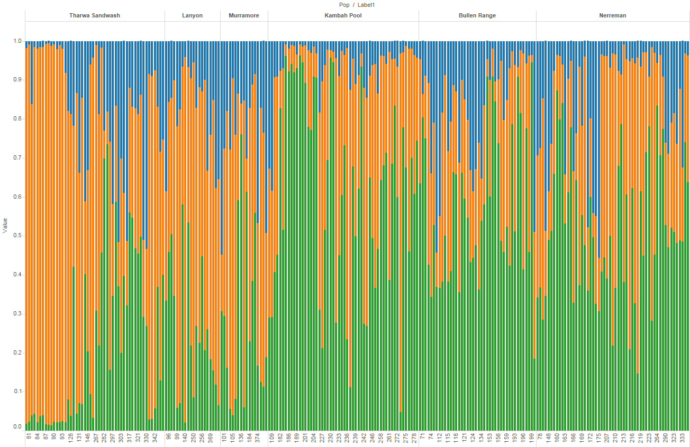

```{r, "Project_Template_and_Knitr", echo=FALSE, warning=FALSE}
#The following 2 and 4 lines are needed if knitr is to work with ProjectTemplate.
require(knitr)
if (basename(getwd()) == "src") setwd("..") #needed to get knitr to work with project template
library('ProjectTemplate') #All projectTemplates need this up front
load.project() #All projectTemplates need this up front
```

```{r "Set_Global_Options", echo=FALSE, warning=FALSE}
options(width=200)
opts_chunk$set(echo=TRUE, warning=FALSE, message=FALSE)
knitr::opts_chunk$set(fig.width=15, fig.height=15,fig.path="/graphs/") #Make Figures larger and save them
```

```{r}
a<-suppressPackageStartupMessages({
library(plyr)
library(dplyr)
library(ggplot2)
library(dart)
library(tsne)
library(stats)
library(pegas)
})

ptm <- proc.time()
```

```{r echo=FALSE,results='hide'}
#read file in
gl<-gl.read.dart(datafile="otherData/larvalPeeliSnps.csv", topskip=5, nmetavar=17, nas="-", ind.metafile="otherData/larvMeta.csv")

gi<-df2genind(data.frame(gl),ncode=1, pop=gl$pop)

```

```{r echo=FALSE}
read_chunk('src/pcaTSNE.R')
```

```{r echo=FALSE}
read_chunk('plotsAveragePIC.R')
```

#Hardy Weinberg and Genotypic Disequilibrium

```{r}
hwdf<-hw.test(gi,B=0)

```


#Population Structure
See:  runPCAandTSNEYearsandSites.Rmd

#Polymorphic Information Content

```{r}
<<averagePIC>>
```

##Genome Structure in Larvae by Years and Sites

###FST and Sites
```{r}
library(StAMPP)
system.time(snpfst <-stamppFst(gl,nboots=1, percent=95, nclusters=8))
snpfst
rm(snpfst)
```
Although not strong some difference in the three upper sites and the three lower sites is evident. The difference between the 3 upper and three lower sites also is greater than the difference among each of the three lower, or the three upper sites.

### Temporal Structure
```{r}
glt<-gl
glt@pop<-as.factor(gl@other$covariates)
system.time(snpfstTemporal <-stamppFst(glt,nboots=1, percent=95, nclusters=8))
snpfstTemporal
rm(glt); rm(npfstTemporal)
```
There is little difference between years.

## Genetic Distance between Sites
```{r}
gi<-df2genind(data.frame(gl),ncode=1, pop=gl$pop)
gp<-genind2genpop(gi)
dist.genpop(gp)
```

#Heterozygosity
```{r}
Hs(gi)
```
This function computes the expected heterozygosity (Hs) within populations of a genpop object. This function is available for codominant markers (@type="codom") only. Hs is commonly used for measuring within population genetic diversity (and as such, it still has sense when computed from haploid data).


```{r PCAtSNEStructure}
<<PCAtSNEStructure>>
```
A little structure is evident if we look at structure based on collection site.

or as a triangle plot
 

Following the evanno method we settled on 3 groups.
 

so with three groups.

 
 

The structure is a associated with collection site.
 

When the structure is examined based on the nest site rather than the collection site which better accounts for putative barriers and unidirectional dispersal. then:

after nests chapter is done

```{r echo=FALSE}
read_chunk('src/dapcAndCorrespondenceAnalysis.R')
```

```{r dapcCorrespondence}
<<dapcCorroStructure>>
```

```{r "Include_Chunk_Labels_and_Session Information"}
all_labels()
proc.time()-ptm
#Session Information
sessionInfo()
```