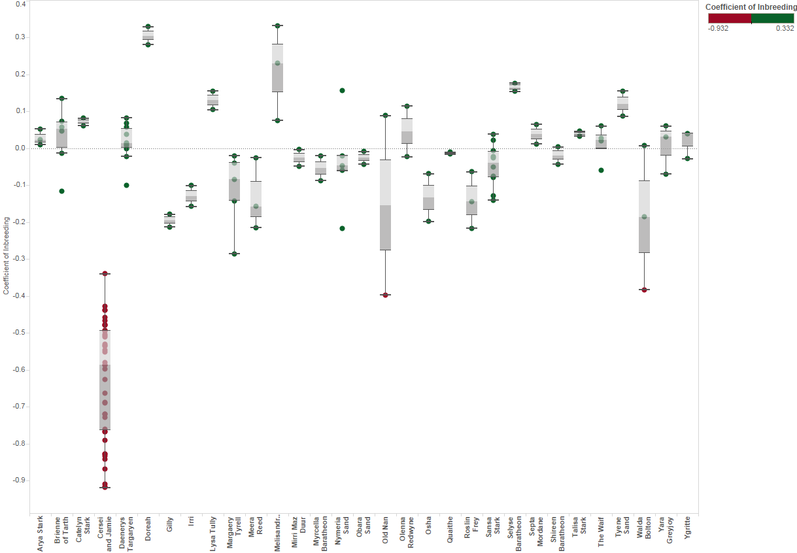
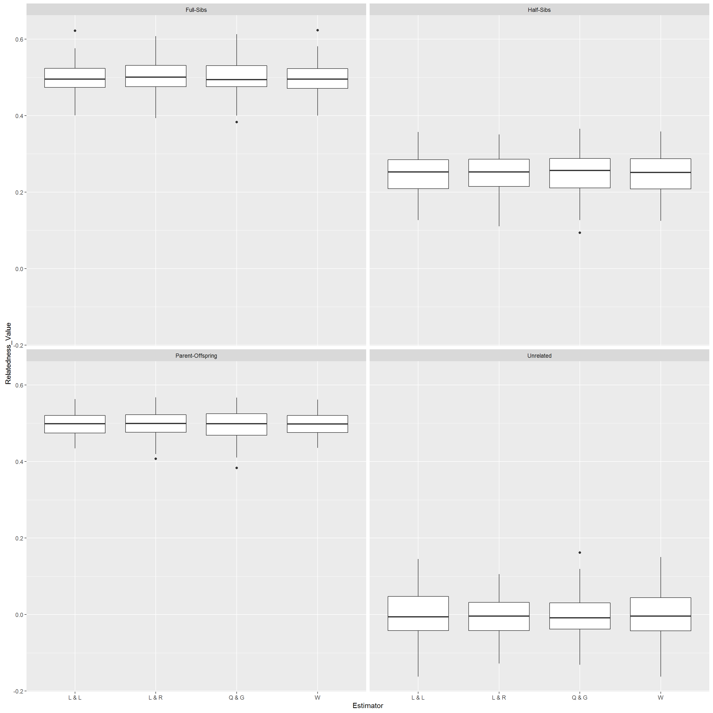
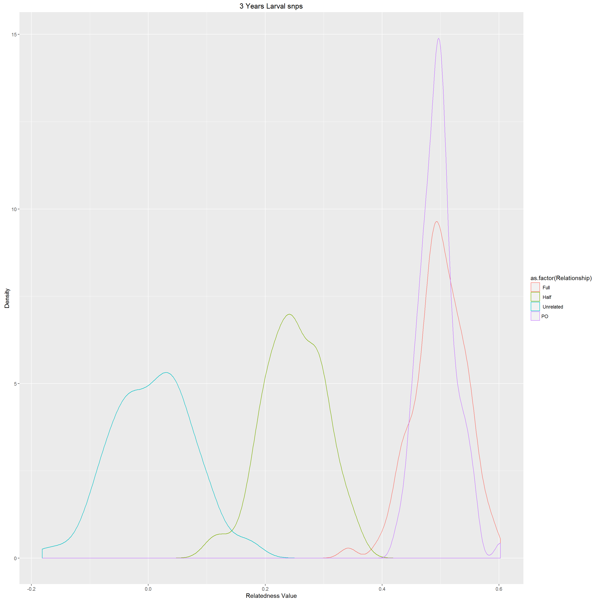
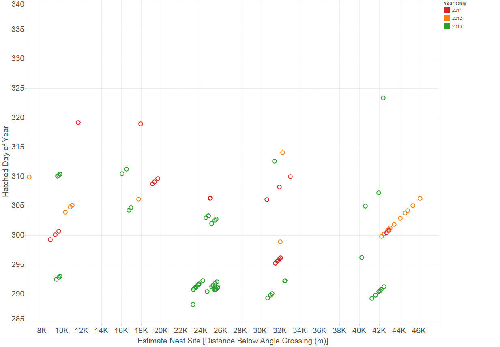
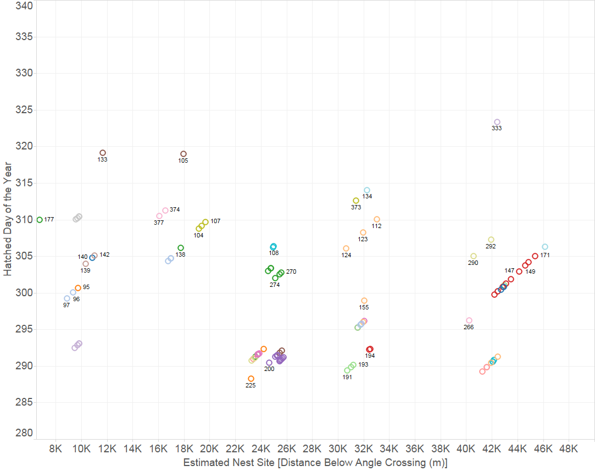
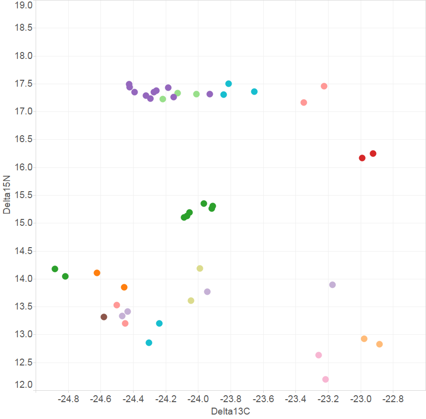
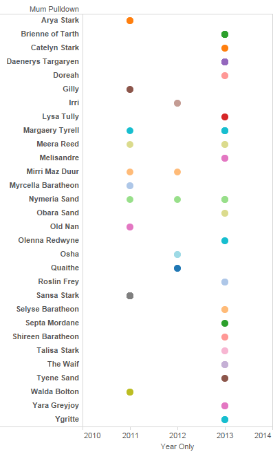

```{r, "Project_Template_and_Knitr", echo=FALSE, warning=FALSE}
#The following 2 and 4 lines are needed if knitr is to work with ProjectTemplate.
require(knitr)
if (basename(getwd()) == "src") setwd("..") #needed to get knitr to work with project template
library('ProjectTemplate') #All projectTemplates need this up front
load.project() #All projectTemplates need this up front
```

```{r "Set_Global_Options", echo=FALSE, warning=FALSE}
options(width=200)
opts_chunk$set(echo=TRUE, warning=FALSE, message=FALSE)

knitr::opts_chunk$set(fig.width=15, fig.height=15,fig.path="graphs/") #Make Figures larger and save them
```

```{r echo=FALSE}
read_chunk('createNet.R')
```

```{r echo=FALSE}
a<-suppressPackageStartupMessages({
library(dplyr)
library(igraph)
library(ggplot2)
})

ptm <- proc.time()
```
#Relatedness and Mating Systems

#Inbreeding

```{r eval=FALSE, echo=FALSE}
require(ggplot2)
main="2011-2013 Larval snps with Adults"
load(file = paste("./outData/",main," coancestoryOutput", sep=""))
inbreds<-data.frame(output$inbreeding)
inb<-merge(inbreds,qslMPeeliiForRelated, by.x="ind.id", by.y = "LarvaID")

inbredPlot<-qplot(inb$mumPulldown,inb$LH)
inbredPlot+theme(axis.text.x = element_text(angle = 90, hjust = 1))
inbredPlot+main("Inbreeding Coefficient")
```


 

It is apparent from the above plot that there is one outlier group with  strongly negative inbreeding coefficients. They are relatively highly outbred, perhaps with stocked Murray cod, such that 'related' incorrectly assigned them as siblings on the basis of alleles they have in common with originating brood stock Murray cod, but that are not present in the endemic upper Murrumbidge Murray Cod. These are not the third and fourth generation hybrid larvae that were not previously excluded from the data set. As the Murray cod lineage wasconfirmed with mitochondrial DNA. First and second generation hybrids and backcrosses had been excluded prioir to this analysis.  These were either omitted from the remaining analysis, or, for the purposes of measuring dispersal, assigned parents based on the spatio-temporal clustering alone. 

# Choosing Relatedness Measures
First we need to choose which estimators we are to use. (see compareEstimators)
The related package offers a choice of algorithms to use as estimators and provides a method to compare estimators using the relevant data to enhance selection. 

 

Given the large number of SNPS each of the estimator algorithms performs very well. In this case we use the maximum likliehood estimator 'trioml'. This was chosen as it enables allowing for inbreeding in the population although it is much slower. 

The simulation provides estimates, based on the allele frequencies, of hypothetical known parent-offspring,full and half siblings, and unrelated individuals. From this the cutoff probabilities for the relatedness values need to be chosen. The cutoff points for the probability between assigning as full siblings or half siblings and a similar distinction between half siblings and 'unrelated' can be selected from a density plot to minimise overlap.

 

Given the large number of snps the cutoffs between classes of siblings are clear choices with little overlap. These are displayed for all years 2011-2013 only as the results for each year individually produced results that differred in probability by less than 0.02. Given the probabilistic nature of the identification of sibling class, and the amount of overlap between classes there is no benefit in changing cutoffs for each years nomination of sibling class.

```{r "Nominate Estimator to Use"}
estimator=5 #5-trioml,6-wang,7-lynchli,8-lynchrd,9-ritland,10-quellergt,11-dyadml
estimatorName="trioml" # change as needed with above
#Also choose which cutoffs to use. These are dependant on density plots
fshsCut<-0.4
hsurCut<-0.17
```

Cut off parameters for the classes were selected. Dyads with a relatedness probability above `r fshsCut` were considered to be full siblings, and dyads with a relatedness probability between `r hsurCut` and `r fshsCut` were assigned as half siblings. Any dyad with a relatedness probability below `r hsurCut` was consisent with the related package assigned as 'unrelated' although really they are merely less related and probably neither a full or half sibling. 

The results of the relatedness dyads, as calculated by 'related' were plotted using iGraph to visualised relatedness between larvae within each year so as to identify full sibling pairs(FS) and  half sibling pairs (HS). Unrelated (UR) is also calculated by the 'r' package 'related'. However we are interested only in FS at this stage to identify common parents and to assist with determining the distance of larval dispersal.

The same is finally ploted for all three years combined.

# 2011 Larval Relatedness Plots
```{r}
main="2011 Larval snps"
fileName=paste("./outData/",main," coancestoryOutput", sep="")
load(file = fileName)
```

```{r Larvae2011Net, echo=FALSE,tidy=TRUE, tidy.opts=list(comment=FALSE)}
<<createNet>>
```

## Refine set and Plot relationships
```{r echo=FALSE}
fileName=paste("./outData/",main," net",sep="")
load(file = fileName)

#Limit to full siblings - this also makes it more sparse.
net.FS <- delete_edges(net, E(net)[weight<fshsCut])
l <- layout_with_fr(net.FS)

V(net.FS)$color=V(net.FS)$YearOnly #assign the "YearOnly" attribute as the vertex color
V(net.FS)$color=gsub("2011","indianred",V(net.FS)$color) #2011 will be red
V(net.FS)$color=gsub("2012","lightgoldenrod1",V(net.FS)$color) #2012 will be blue
V(net.FS)$color=gsub("2013","lightgreen",V(net.FS)$color) #2013 will be blue

E(net.FS)$weight<-E(net.FS)$weight*5

plot(net.FS, edge.arrow.size=0, edge.curved=0.2, vertex.size=5, vertex.color=V(net.FS)$color,vertex.frame.color="#555555",vertex.label=V(net)$name, vertex.label.color="black",vertex.label.cex=.7,edge.width=E(net.FS)$weight,layout=l)
#removed main=main;added edge.width=E(net.FS)$weight
title(paste(estimatorName,main),cex.main=3)
legend(x=-1.5, y=-1.1, c("2011","2012", "2013"), pch=21,col="#777777", cex=.8, bty="n", ncol=1)
```

There are `r length(unique(nrelData$id))` individuals and `r nrow(lrelData)` related dyads. There are `r sum(degree(net)==0)` 30 families.

# 2012 Larval Relatedness Plots
```{r}
main="2012 Larval snps"
load(file = paste("./outData/",main," coancestoryOutput", sep=""))
```
```{r Larvae2012Net, echo=FALSE,tidy=TRUE, tidy.opts=list(comment=FALSE)}
<<createNet>>
```
## Refine set and Plot relationships
```{r echo=FALSE}
fileName=paste0("outData/",main," net",sep=" ")
load(fileName) 

#Limit to full siblings - this also makes it more sparse.
net.FS <- delete_edges(net, E(net)[weight<fshsCut])
l <- layout_with_fr(net.FS)

V(net.FS)$color=V(net.FS)$YearOnly #assign the "YearOnly" attribute as the vertex color
V(net.FS)$color=gsub("2011","indianred",V(net.FS)$color) #2011 will be red
V(net.FS)$color=gsub("2012","lightgoldenrod1",V(net.FS)$color) #2012 will be blue
V(net.FS)$color=gsub("2013","lightgreen",V(net.FS)$color) #2013 will be blue

E(net.FS)$weight<-E(net.FS)$weight*5

plot(net.FS, edge.arrow.size=0, edge.curved=0.2, vertex.size=5, vertex.color=V(net.FS)$color,vertex.frame.color="#555555",vertex.label=V(net)$name, vertex.label.color="black",vertex.label.cex=.7,edge.width=E(net.FS)$weight,layout=l)
#removed main=main;added edge.width=E(net.FS)$weight
title(paste(estimatorName,main),cex.main=3)
legend(x=-1.5, y=-1.1, c("2011","2012", "2013"), pch=21,col="#777777", cex=.8, bty="n", ncol=1)
```

There are `r length(unique(nrelData$id))` individuals and `r nrow(lrelData)` related dyads. There are `r sum(degree(net)==0)` 38 families.
# 2013 Larval Relatedness Plots
```{r}
main="2013 Larval snps"
load(file = paste("./outData/",main," coancestoryOutput", sep=""))
```
```{r Larvae2013Net, echo=FALSE,tidy=TRUE, tidy.opts=list(comment=FALSE)}
<<createNet>>
```
## Refine set and Plot relationships
```{r echo=FALSE}
fileName=paste("./outData/",main," net",sep="")
load(file = fileName)
#Limit to full siblings - this also makes it more sparse.
net.FS <- delete_edges(net, E(net)[weight<fshsCut])
l <- layout_with_fr(net.FS)

V(net.FS)$color=V(net.FS)$YearOnly #assign the "YearOnly" attribute as the vertex color
V(net.FS)$color=gsub("2011","indianred",V(net.FS)$color) #2011 will be red
V(net.FS)$color=gsub("2012","lightgoldenrod1",V(net.FS)$color) #2012 will be blue
V(net.FS)$color=gsub("2013","lightgreen",V(net.FS)$color) #2013 will be blue

E(net.FS)$weight<-E(net.FS)$weight*5

plot(net.FS, edge.arrow.size=0, edge.curved=0.2, vertex.size=5, vertex.color=V(net.FS)$color,vertex.frame.color="#555555",vertex.label=V(net)$name, vertex.label.color="black",vertex.label.cex=.7,edge.width=E(net.FS)$weight,layout=l)
#removed main=main;added edge.width=E(net.FS)$weight
title(paste(estimatorName,main),cex.main=3)
legend(x=-1.5, y=-1.1, c("2011","2012", "2013"), pch=21,col="#777777", cex=.8, bty="n", ncol=1)
```

There are `r length(unique(nrelData$id))` individuals and `r nrow(lrelData)` related dyads. There are `r sum(degree(net)==0)` 70 families.
# 2011-2013 Larval Relatedness Plots
```{r}
main="2011-2013 Larval snps"
load(file = paste("./outData/",main," coancestoryOutput", sep=""))
```
```{r Larvae2011-2013Net, echo=FALSE,tidy=TRUE, tidy.opts=list(comment=FALSE)}
<<createNet>>
```
## Refine set and Plot relationships
```{r echo=FALSE}
fileName=paste("./outData/",main," net",sep="")
load(file = fileName)
#Limit to full siblings - this also makes it more sparse.
net.FS <- delete_edges(net, E(net)[weight<fshsCut])
l <- layout_with_fr(net.FS)

V(net.FS)$color=V(net.FS)$YearOnly #assign the "YearOnly" attribute as the vertex color
V(net.FS)$color=gsub("2011","indianred",V(net.FS)$color) #2011 will be red
V(net.FS)$color=gsub("2012","lightgoldenrod1",V(net.FS)$color) #2012 will be blue
V(net.FS)$color=gsub("2013","lightgreen",V(net.FS)$color) #2013 will be blue

E(net.FS)$weight<-E(net.FS)$weight*5

plot(net.FS, edge.arrow.size=0, edge.curved=0.2, vertex.size=5, vertex.color=V(net.FS)$color,vertex.frame.color="#555555",vertex.label=V(net)$name, vertex.label.color="black",vertex.label.cex=.7,edge.width=E(net.FS)$weight,layout=l)
#removed main=main;added edge.width=E(net.FS)$weight
title(paste(estimatorName,main),cex.main=3)
legend(x=-1.5, y=-1.1, c("2011","2012", "2013"), pch=21,col="#777777", cex=.8, bty="n", ncol=1)
``` 

There are `r length(unique(nrelData$id))` individuals and `r nrow(lrelData)` related dyads. There are `r sum(degree(net)==0)` families.

```{r echo=FALSE}
read_chunk('createNetAdults.R')
```

# 2011-2013 Larvae Relatedness with Adults
```{r}
main="2011-2013 Larval snps with Adults"
load(file = paste("./outData/",main," coancestoryOutput", sep=""))
```
```{r LarvaeAdults2011-2013Net, echo=FALSE,tidy=TRUE, tidy.opts=list(comment=FALSE)}
<<createNetA>>
```
## Refine set and Plot relationships
```{r echo=FALSE}
fileName=paste("./outData/","2011-2013 Larval snps with Adults"," net",sep="")
load(file = fileName)
#Limit to full siblings - this also makes it more sparse.
net.FS <- delete_edges(net, E(net)[weight<fshsCut])
l <- layout_with_fr(net.FS)

plot(net.FS, edge.arrow.size=0, edge.curved=0, vertex.size=5,vertex.color=c("orange", "cyan")[(V(net.FS)$type=="larvae")+1], vertex.frame.color="#555555",vertex.label=V(net)$name, vertex.label.color="black",vertex.label.cex=.7,layout=l)
title(paste(estimatorName,main),cex.main=3)
``` 

# 2011-2013 Larvae with Parents
# Nominating Parents 
Given the above we can nominate putative parents for each family group. Initially we do this without allowing for the possibility of polygynous or polyandrous matings. 
```{r echo=FALSE}
#Prepare data
prelDataA<-cbind(larvNrel[,c(1,13)],rep("1",nrow(larvNrel)),rep("mother",nrow(larvNrel)))

colnames(prelDataA)[1]<-"from"
colnames(prelDataA)[2]<-"to"
colnames(prelDataA)[3]<-"weight"
colnames(prelDataA)[4]<-"type"

prelDataB<-cbind(larvNrel[,c(1,14)],rep("1",nrow(larvNrel)),rep("father",nrow(larvNrel)))
colnames(prelDataB)[1]<-"from"
colnames(prelDataB)[2]<-"to"
colnames(prelDataB)[3]<-"weight"
colnames(prelDataB)[4]<-"type"
prelData<-rbind(prelDataA,prelDataB)
prelData[prelData==""] <- NA
rm(prelDataB);rm(prelDataA)
tmp<-prelData[complete.cases(prelData),]

#Create Vertices Data Frame
prelVert <- data.frame(matrix(ncol = 4, nrow = nrow(tmp)))
colnames(prelVert) <- c("id", "name", "type", "label")

prelVert$id<-tmp$to
prelVert$name<-tmp$to
prelVert$type<-tmp$type
prelVert<-rbind(prelVert, nrelData)
prelVert<-unique(prelVert)


prelData<-prelData[complete.cases(prelData),]

prelData <- subset(prelData, !from == 177) #these line needed to remove a few potential contaminants
prelData <- subset(prelData, !from == 314) #although I doubt there was actually contam as the otherhs are the same.
prelData <- subset(prelData, !from == 366)


require(igraph)
net.parents<-graph_from_data_frame(d=prelData, vertices=prelVert, directed=FALSE)

l <- layout_with_fr(net.parents)

#Colour vertices :parents and larvae
V(net.parents)$color=V(net.parents)$type #assign the "type" attribute as the vertex color then assign a colour based on that type.
V(net.parents)$color=gsub("mother","lightpink",V(net.parents)$color)
V(net.parents)$color=gsub("father","lightblue",V(net.parents)$color)
V(net.parents)$color=gsub("larvae","lightgreen",V(net.parents)$color)
V(net.parents)$color=gsub("adult","orange",V(net.parents)$color)

plot(net.parents, edge.arrow.size=0, edge.curved=0, vertex.size=5, vertex.color=V(net.parents)$color,vertex.frame.color="#555555",vertex.label=V(net.parents)$name, vertex.label.color="black",vertex.label.cex=.7,layout=l, main = "Full Siblings With Parents")
```

# 2011-2013 With Parents and half-sibling links
Half siblings can help us identify parents in common.

```{r "Half Siblings with Parents", echo=FALSE}
##Now to add in sib weights so we can include half sibs and exclude full sib edges.
prelData$weight<-as.numeric(as.character(prelData$weight))
allData<-rbind(prelData, lrelData)
allData<-allData[complete.cases(allData),]
net.all<-graph_from_data_frame(d=allData, vertices=prelVert, directed=FALSE)

#set parmeters for edges to delete (so they dont show and clutter the graph)
net.all <- delete_edges(net.all, E(net.all)[weight>0.379])
net.all <- delete_edges(net.all, E(net.all)[weight<0.2])

#to colour half sibling edges according to weight 
E(net.all)[ weight > .34 ]$color <- "darkgreen"
E(net.all)[ weight < .3 ]$color <- "green"
E(net.all)[ weight < .24 ]$color <- "yellow"

#to colour parents and larvae
V(net.all)$color=V(net.all)$type #assign the "type" attribute as the vertex color
V(net.all)$color=gsub("mother","lightpink",V(net.all)$color) #mums will be pink
V(net.all)$color=gsub("father","lightblue",V(net.all)$color) #dads will be blue
V(net.all)$color=gsub("larvae","lightgreen",V(net.all)$color) #larvae will be green
V(net.all)$color=gsub("adult","orange",V(net.all)$color) #adult will be orange

plot(net.all, edge.arrow.size=0, edge.curved=0, vertex.size=5, vertex.color=V(net.all)$color,vertex.frame.color="#555555",vertex.label=V(net.all)$name, vertex.label.color="black",vertex.label.cex=.7,layout=l, main = "Half Siblings With Parents")
```

## Half sibs coloured by Year
```{r HalfSibsColouredByYear, echo=FALSE}
#Now another look coloured by Years
net.all<-graph_from_data_frame(d=allData, vertices=prelVert, directed=FALSE)

#set parmeters for edges to delete (so they dont show and clutter the graph)
net.all <- delete_edges(net.all, E(net.all)[weight>0.379])
net.all <- delete_edges(net.all, E(net.all)[weight<0.2])

#to colour half sibling edges according to weight 
E(net.all)[ weight > .34 ]$color <- "darkgreen"
E(net.all)[ weight < .3 ]$color <- "green"
E(net.all)[ weight < .24 ]$color <- "yellow"

#to colour vertices by yearsparents and larvae
V(net.all)$color=gsub("mother","lightpink",V(net.all)$color) #mums will be pink
V(net.all)$color=gsub("father","lightblue",V(net.all)$color) #dads will be blue
V(net.all)[name<134]$color<-"red"#2011 will be red
V(net.all)[name>133]$color<-"yellow"#2012 will be yellow
V(net.all)[name>184]$color<-"lightgreen" #2013 will be green


plot(net.all, edge.arrow.size=0, edge.curved=0, vertex.size=5, vertex.color=V(net.all)$color,vertex.frame.color="#555555",vertex.label=V(net.all)$name, vertex.label.color="black",vertex.label.cex=.7,layout=l, main = "Half Siblings With Some Parents Coloured by Year")
```

#Support for Estimates of Parental Assignments
The uncertainty around the estimates of parental assignment is not clear from the probability data alone. Related meta data provides the opportunity to test assignments

##Spatial and Temporal Correlation
 

Nests were assigned on the basis of larvae spatial and temporal positioning, as seen in the above plot.

 


##Correlation with parental biogeochemical markers
Assignment of mothers to larvae based on isotpic ratios also seems to bear out the assignment. There is only one unclustered group that show little correlation between identity of mother and deltaN, deltaC isotopic ratios.

 mumCNratios

#Probability of Multi Year Pair Bonds


Figure shows there are four pairs that mate more than one of the three years. The probability of this occurring for each female can be calculated as follows.

p=(1/n-1)^y-1 

y = number of years same mate selected
n = number of opposite sex 
n is approximated by number of family groups. In practice there are less mates to choose from than that because some will be involved in polyganous and polyandrous matings. So a conservative estimate of n would be number(families)/2. Also to err on conservative side we should divide n by three to account for mates being selected from only adjacent sites (two sites) rather than the whole reach (six sites). This conservatively allows for some barriers to adult movement but also that the adults are known to migrate between more than one site in some cases (female Nymeria is an example) OR REFKoehn. We should further reduce n to be conservative regarding assortative mating on size class. Again we will divide by 3. Thus n = number of families/12. 

Thus the probability of Nymeria mating with the same male for three of the three years is:

p = (1/((30+38+70)/12)-1)^(3-1)

p = `r (1/(((30+38+70)/12)-1))^(3-1)`

The probability of Mirri, Meere and Margery each mating mating with the same male for two of the three years is:
p = (1/((30+38+70)/12)-1)^(2-1)

p =`r (1/(((30+38+70)/12)-1))^(2-1)`
`r p<-(1/(((30+38+70)/12)-1))^(2-1)`

Thus the probability of all three selecting the same mate is p^(n-1)

p = `r (p^(3-1))`

The probability of the rest of the females mating with a male for one of the three years is neccessarily one:

p = (1/((30+38+70)/12)-1)^(1-1)

p =`r (1/(((30+38+70)/12)-1))^(1-1)`

Thus it seems improbable that the inter year pair bonding is merely random assortment of adult fish given p = `r round((p^(3-1)),digits=3)`.  

#Session Info
```{r "Include_Chunk_Labels_and_Session Information"}
all_labels()
proc.time()-ptm
#Session Information
sessionInfo()

```